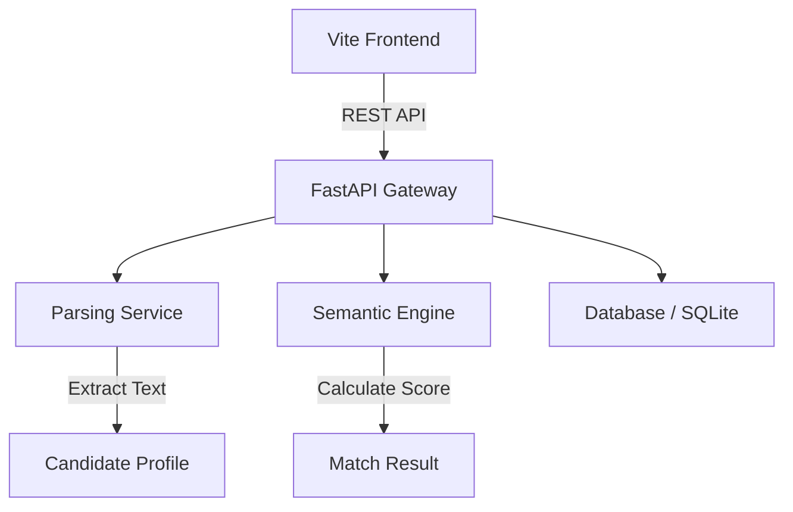

# HireWell AI: Backend Engineering Suite

This directory contains the high-performance backend services for the HireWell recruitment platform. Built with **FastAPI**, it handles the compute-intensive tasks of resume parsing, semantic matching, and talent analytics.

## 🛠 Tech Stack

*   **Framework**: FastAPI (Python 3.12+)
*   **Parsing**: `pypdf` (PDF), `python-docx` (DOCX)
*   **Database**: SQLite (Development) with SQLAlchemy ORM
*   **Migrations**: Alembic
*   **Validation**: Pydantic v2
*   **Task Processing**: Asyncio

## 📁 Architecture Overview



## 🚀 Key Endpoints

### 1. Job Management
*   `POST /api/jobs`: Create a new job description session.
*   `GET /api/jobs/{id}`: Retrieve JD analysis and weights.

### 2. Candidate Ingestion
*   `POST /api/candidates/upload`: Multi-part file upload with real-time parsing.
*   `GET /api/candidates`: List all processed candidates for a specific job.

### 3. Matching Engine
*   `POST /api/matching/run`: Trigger the semantic matching algorithm.
*   `GET /api/matching/results`: Retrieve ranked shortlists with confidence scores.

## ⚙️ Setup & Installation

1.  **Navigate to Backend**:
    ```bash
    cd backend
    ```

2.  **Create Virtual Environment**:
    ```bash
    python -m venv venv
    source venv/bin/activate  # Windows: venv\Scripts\activate
    ```

3.  **Install Dependencies**:
    ```bash
    pip install -r requirements.txt
    ```

4.  **Run Migrations**:
    ```bash
    alembic upgrade head
    ```

5.  **Launch Server**:
    ```bash
    uvicorn app.main:app --reload --port 8000
    ```

## 🧠 Semantic Matching Logic
The backend uses a **Weighted Vector Similarity** approach:
*   **Hard Skills (60%)**: Direct match between required tools and resume content.
*   **Experience (20%)**: Extraction of years of experience vs. mandatory requirements.
*   **Domain Alignment (20%)**: Semantic proximity of past projects to the target industry.

---
*Optimized for sub-second analysis of large resume batches.*
